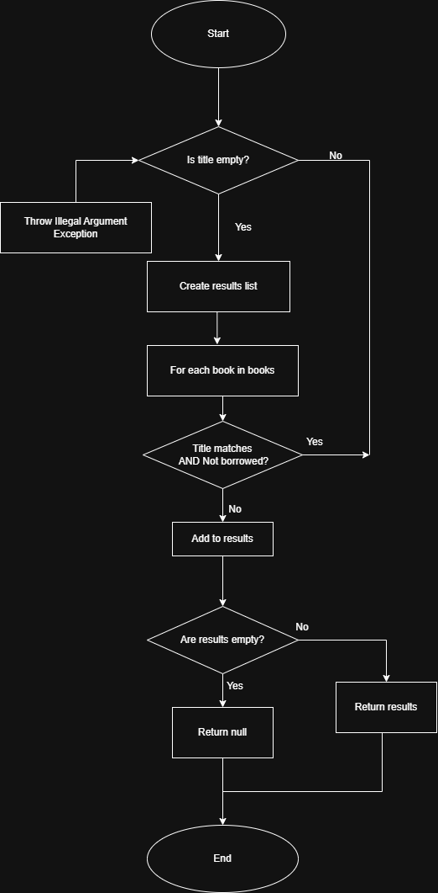
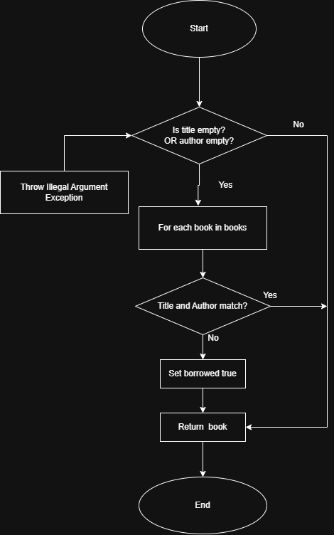

Стефан Здравковски
231246
## Control Flow Graphs
  

## Cyclomatic Complexity

Формула:  
CC = E - N + 2  
каде E = број на ребра (edges), N = број на јазли (nodes).  
Алтернативно: CC = број на услови + 1.

### searchBookByTitle
Оваа функција има еден услов – проверка дали насловот на книгата е ист со бараната.  
CC = 1 + 1 = **2**  
Објаснување: Еден услов создава две независни патеки → книгата е пронајдена или не е пронајдена.

### borrowBook
Оваа функција има два услови – прво се проверува дали книгата е достапна, а потоа дали корисникот има членска картичка.  
CC = 2 + 1 = **3**  
Објаснување: Два услови создаваат три независни патеки → успешно позајмување, нема картичка, или книгата е недостапна.
